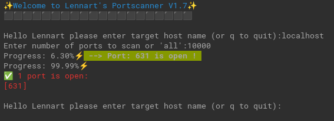

# Lennart's Portscanner V1.7

Welcome to Lennart's Portscanner V1.7! This simple and efficient tool allows you to scan a target host for open ports.

## Features

- Interactive user interface to specify the target host and the number of ports to scan.
- Ability to scan all ports (1-65535) or a specific number of ports.
- Progress display during the scanning process.
- Listing of open ports at the end of the scanning process.

## Usage

1. Clone the repository to your local machine.
2. Navigate to the project directory.
3. Run `go run .` to start the port scanner.
4. Follow the prompts in the terminal to specify the target host and the number of ports to scan.

## Dependencies

This project utilizes the `misc` package from the repository `github.com/Lennart1978/Portscanner/misc` for some helper functions.
